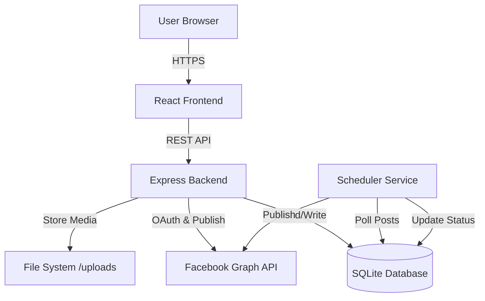

# Design Document: Facebook Post Scheduler

## Overview

The Facebook Post Scheduler is a full-stack web application that enables users to schedule and automatically publish content to their Facebook Pages. The system consists of a React frontend, Node.js/Express backend, SQLite database, and a background scheduler service that executes posts at specified times.

The application follows a client-server architecture where the frontend handles user interactions and the backend manages authentication, data persistence, media storage, and integration with Facebook's Graph API. A separate scheduler process runs continuously to monitor pending posts and publish them at their scheduled times.

Key technical decisions:
- **SQLite for persistence**: Lightweight, serverless database suitable for single-instance deployments
- **File-based media storage**: Simple approach storing uploads in the filesystem rather than cloud storage
- **Polling-based scheduler**: 60-second interval checks for due posts (trade-off between responsiveness and resource usage)
- **OAuth 2.0 flow**: Standard Facebook authentication with token-based authorization

## Architecture

The system is composed of four main layers:

### 1. Frontend Layer (React)
- Single-page application providing the user interface
- Handles user authentication flow initiation
- Manages post creation forms with media upload
- Displays scheduled posts with status indicators
- Communicates with backend via REST API

### 2. Backend Layer (Node.js + Express)
- RESTful API server handling all business logic
- Authentication service managing OAuth flow
- Upload service for media file handling
- Database access layer for CRUD operations
- Configuration parser and validator

### 3. Data Layer (SQLite)
- Persistent storage for users, posts, and metadata
- Encrypted token storage
- Foreign key relationships ensuring data integrity

### 4. Scheduler Service
- Background process running independently
- Polls database every 60 seconds for due posts
- Publishes posts via Facebook Graph API
- Updates post status and logs results



## Components and Interfaces

### Authentication Service

**Responsibilities:**
- Initiate Facebook OAuth flow
- Exchange authorization codes for access tokens
- Store and retrieve encrypted tokens
- Validate token expiry and trigger re-authentication

**Key Methods:**
```typescript
interface AuthenticationService {
  initiateLogin(): string; // Returns OAuth redirect URL
  handleCallback(code: string): Promise<AccessToken>;
  getStoredToken(userId: string): Promise<AccessToken | null>;
  refreshToken(userId: string): Promise<AccessToken>;
}
```

**Dependencies:**
- Facebook Graph API OAuth endpoints
- Users table in database
- Encryption library for token storage

### Upload Service

**Responsibilities:**
- Validate file types and sizes
- Store media files in filesystem
- Generate and return file paths
- Clean up failed uploads

**Key Methods:**
```typescript
interface UploadService {
  uploadImages(files: File[]): Promise<string[]>; // Returns file paths
  uploadVideo(file: File): Promise<string>;
  validateFile(file: File): boolean;
  deleteFile(path: string): Promise<void>;
}
```

**Constraints:**
- Maximum file size: 100MB
- Supported image formats: JPEG, PNG, GIF
- Supported video formats: MP4, MOV, AVI
- Maximum images per post: 10

### Post Management Service

**Responsibilities:**
- Create new scheduled posts
- Retrieve posts for display
- Delete pending/failed posts
- Validate post data

**Key Methods:**
```typescript
interface PostManagementService {
  createPost(post: PostData): Promise<Post>;
  getPosts(userId: string): Promise<Post[]>;
  deletePost(postId: string): Promise<void>;
  updatePostStatus(postId: string, status: Status, error?: string): Promise<void>;
}

interface PostData {
  caption: string;
  mediaUrls: string[];
  mediaType: 'image' | 'video';
  scheduledTime: Date;
  pageId: string;
  userId: string;
}
```

### Scheduler Service

**Responsibilities:**
- Poll database for due posts
- Publish posts via Graph API
- Update post status
- Implement retry logic with exponential backoff
- Respect API rate limits

**Key Methods:**
```typescript
interface SchedulerService {
  checkAndPublishPosts(): Promise<void>;
  publishPost(post: Post): Promise<PublishResult>;
  handleRateLimit(error: RateLimitError): Promise<void>;
}
```

**Publishing Logic:**
- Single image: POST to `/page-id/photos`
- Multiple images: POST to `/page-id/photos` with batch upload
- Video: POST to `/page-id/videos`

### Facebook Graph API Client

**Responsibilities:**
- Wrap Graph API calls
- Handle authentication headers
- Parse API responses
- Manage rate limiting

**Key Methods:**
```typescript
interface GraphAPIClient {
  getPages(accessToken: string): Promise<FacebookPage[]>;
  publishPhoto(pageId: string, photoUrl: string, caption: string): Promise<string>;
  publishPhotos(pageId: string, photoUrls: string[], caption: string): Promise<string>;
  publishVideo(pageId: string, videoUrl: string, caption: string): Promise<string>;
}
```

### Configuration Parser

**Responsibilities:**
- Parse configuration files into structured objects
- Validate required fields
- Format configuration objects back to file format

**Key Methods:**
```typescript
interface ConfigParser {
  parse(configFile: string): Result<Configuration, Error>;
  validate(config: Configuration): Result<void, Error>;
  prettyPrint(config: Configuration): string;
}

interface Configuration {
  databasePath: string;
  uploadDirectory: string;
  facebookAppId: string;
  facebookAppSecret: string;
  schedulerInterval?: number;
  maxFileSize?: number;
}
```

## Data Models

### Users Table
```sql
CREATE TABLE users (
  id INTEGER PRIMARY KEY AUTOINCREMENT,
  facebook_user_id TEXT UNIQUE NOT NULL,
  access_token TEXT NOT NULL,  -- Encrypted
  token_expiry INTEGER NOT NULL,
  created_at INTEGER NOT NULL
);
```

### Posts Table
```sql
CREATE TABLE posts (
  id INTEGER PRIMARY KEY AUTOINCREMENT,
  user_id INTEGER NOT NULL,
  caption TEXT NOT NULL,
  media_url TEXT NOT NULL,  -- JSON array for multiple images
  media_type TEXT NOT NULL CHECK(media_type IN ('image', 'video')),
  scheduled_time INTEGER NOT NULL,
  status TEXT NOT NULL CHECK(status IN ('pending', 'posted', 'failed')),
  page_id TEXT NOT NULL,
  created_at INTEGER NOT NULL,
  error_message TEXT,
  FOREIGN KEY (user_id) REFERENCES users(id) ON DELETE CASCADE
);

CREATE INDEX idx_scheduled_time ON posts(scheduled_time, status);
```

### Domain Models

**Post Entity:**
```typescript
interface Post {
  id: number;
  userId: number;
  caption: string;
  mediaUrls: string[];
  mediaType: 'image' | 'video';
  scheduledTime: Date;
  status: 'pending' | 'posted' | 'failed';
  pageId: string;
  createdAt: Date;
  errorMessage?: string;
}
```

**User Entity:**
```typescript
interface User {
  id: number;
  facebookUserId: string;
  accessToken: string;  // Encrypted in storage
  tokenExpiry: Date;
  createdAt: Date;
}
```

**FacebookPage:**
```typescript
interface FacebookPage {
  id: string;
  name: string;
  accessToken: string;
}
```


## Correctness Properties

A property is a characteristic or behavior that should hold true across all valid executions of a system—essentially, a formal statement about what the system should do. Properties serve as the bridge between human-readable specifications and machine-verifiable correctness guarantees.

### Property 1: OAuth Code Exchange

For any valid Facebook authorization code, the Authentication Service should successfully exchange it for an access token.

**Validates: Requirements 1.2**

### Property 2: Token Storage Round-Trip

For any access token stored by the Authentication Service, retrieving it should return an equivalent encrypted token that can be decrypted to the original value.

**Validates: Requirements 1.3, 9.1**

### Property 3: Expired Token Detection

For any access token with an expiry time in the past, the system should detect it as expired and trigger re-authentication.

**Validates: Requirements 1.4**

### Property 4: Page List Rendering Completeness

For any list of Facebook Pages, the rendered output should contain both the name and ID for each page.

**Validates: Requirements 2.3**

### Property 5: API Error Message Propagation

For any Graph API request that fails, the system should return a descriptive error message to the caller.

**Validates: Requirements 2.4**

### Property 6: Valid File Format Acceptance

For any file with format JPEG, PNG, GIF, MP4, MOV, or AVI, the Upload Service should accept it based on its media type (image formats for images, video formats for videos).

**Validates: Requirements 3.1, 3.2**

### Property 7: Multiple Image Upload Support

For any set of valid image files (up to 10), the Upload Service should successfully accept and store all of them.

**Validates: Requirements 3.3**

### Property 8: Uploaded File Accessibility

For any successfully uploaded media file, the returned file path should point to an accessible file in the uploads directory.

**Validates: Requirements 3.5, 3.7**

### Property 9: Required Field Validation

For any post submission missing one or more required fields (caption, media, scheduled time, or page ID), the backend should reject it with a validation error.

**Validates: Requirements 4.2**

### Property 10: New Post Initial State

For any newly created post, its status should be "pending" and all specified fields (caption, media URLs, media type, scheduled time, page ID, creation timestamp) should be present in the database.

**Validates: Requirements 4.3, 4.4**

### Property 11: Post Creation Round-Trip

For any valid post data submitted to the backend, the returned post details should contain equivalent values for all fields.

**Validates: Requirements 4.6**

### Property 12: Post List Rendering Completeness

For any list of posts, the rendered output should include caption, media preview, scheduled time, page name, and status for each post.

**Validates: Requirements 5.2**

### Property 13: Post List Chronological Ordering

For any list of posts, the output should be sorted by scheduled time in ascending order (earliest first).

**Validates: Requirements 5.3**

### Property 14: Post Deletion Removes Record

For any post that exists in the database, successfully deleting it should result in the post no longer being retrievable.

**Validates: Requirements 5.5**

### Property 15: Deletion Status Restriction

For any post with status "posted", attempting to delete it should be rejected; only posts with status "pending" or "failed" should be deletable.

**Validates: Requirements 5.6**

### Property 16: Due Post Publishing Trigger

For any post with status "pending" and scheduled time less than or equal to the current time, the scheduler should attempt to publish it.

**Validates: Requirements 6.2**

### Property 17: Caption Inclusion in Publish Request

For any post being published, the Graph API request should include the post's caption.

**Validates: Requirements 6.5**

### Property 18: Successful Publish Status Update

For any post where the Graph API publish request succeeds, the post status should be updated to "posted".

**Validates: Requirements 6.6**

### Property 19: Failed Publish Status Update

For any post where the Graph API publish request fails, the post status should be updated to "failed".

**Validates: Requirements 6.7**

### Property 20: Publishing Attempt Logging

For any publishing attempt, there should be a log entry containing a timestamp and the result (success or failure).

**Validates: Requirements 6.8**

### Property 21: API Error Detail Logging

For any Graph API request that fails, the system should log the error code and error message.

**Validates: Requirements 7.1**

### Property 22: Failed Post Error Persistence

For any post that fails to publish, the error message should be stored in the database's error_message field.

**Validates: Requirements 7.2**

### Property 23: Error HTTP Status Code Mapping

For any backend error, the HTTP response status code should be 400 for client errors (invalid input) and 500 for server errors (internal failures).

**Validates: Requirements 7.4**

### Property 24: Failed Upload Cleanup

For any file upload that fails, there should be no partially uploaded files remaining in the uploads directory.

**Validates: Requirements 7.5**

### Property 25: Rate Limit Error Handling

For any Graph API response indicating a rate limit error, the system should log the error and schedule a retry after the specified wait time.

**Validates: Requirements 8.1**

### Property 26: Exponential Backoff Timing

For any sequence of failed publishing attempts for the same post, the delay between retries should increase exponentially (e.g., 1s, 2s, 4s, 8s).

**Validates: Requirements 8.2**

### Property 27: API Request Rate Limiting

For any user, the total number of Graph API requests within a 1-hour window should not exceed 200.

**Validates: Requirements 8.3**

### Property 28: Near-Limit Post Queuing

For any post scheduled when the system is approaching rate limits (e.g., >180 requests in the current hour), the post should be queued for delayed execution rather than attempted immediately.

**Validates: Requirements 8.4**

### Property 29: Token Encryption in Storage

For any access token stored in the database, the stored value should be encrypted (not plaintext).

**Validates: Requirements 9.1**

### Property 30: Token Exclusion from Responses

For any API response or log entry, access tokens should not be present in the output.

**Validates: Requirements 9.2**

### Property 31: Input Sanitization

For any user input containing potentially malicious content (e.g., SQL injection patterns, script tags), the backend should sanitize it before processing.

**Validates: Requirements 9.4**

### Property 32: Foreign Key Constraint Enforcement

For any attempt to create a post with a user_id that doesn't exist in the users table, the database should reject the operation with a foreign key constraint error.

**Validates: Requirements 10.3**

### Property 33: Multi-Image Path Storage Format

For any post with multiple uploaded images, the media_url field should contain a valid JSON array of file paths.

**Validates: Requirements 11.1**

### Property 34: Multi-Image Thumbnail Display

For any post with multiple uploaded images, the UI should display a thumbnail for each image.

**Validates: Requirements 11.4**

### Property 35: Configuration Parsing Success

For any valid configuration file, the Config Parser should successfully parse it into a Configuration object with all fields populated.

**Validates: Requirements 12.1**

### Property 36: Invalid Configuration Error Reporting

For any invalid configuration file (malformed syntax or missing required fields), the Config Parser should return a descriptive error message.

**Validates: Requirements 12.2, 12.3**

### Property 37: Configuration Pretty Printing

For any Configuration object, the Pretty Printer should format it into a valid configuration file string.

**Validates: Requirements 12.4**

### Property 38: Configuration Round-Trip Preservation

For any valid Configuration object, parsing then pretty printing then parsing again should produce an equivalent Configuration object.

**Validates: Requirements 12.5**

## Error Handling

The system implements comprehensive error handling across all layers:

### Authentication Errors
- **Expired tokens**: Detected by checking token_expiry against current time; triggers re-authentication flow
- **Invalid OAuth codes**: Graph API returns error; system logs and displays user-friendly message
- **Missing permissions**: Detected during page retrieval; prompts user to re-authorize with correct scopes

### Upload Errors
- **Oversized files**: Rejected before upload begins; returns 400 error with size limit message
- **Invalid formats**: Validated by file extension and MIME type; returns 400 error
- **Storage failures**: Caught during file write; triggers cleanup of partial files; returns 500 error
- **Disk space**: Caught as filesystem error; returns 500 error with actionable message

### Publishing Errors
- **Rate limiting**: Detected from Graph API error code; implements exponential backoff and retry
- **Network failures**: Caught as timeout or connection error; retries with backoff; marks post as failed after max retries
- **Invalid page permissions**: Graph API returns permission error; marks post as failed with descriptive error message
- **Malformed media**: Graph API rejects upload; marks post as failed; stores error for user review

### Database Errors
- **Constraint violations**: Foreign key or check constraint failures return 400 error
- **Connection failures**: Caught at startup and during operations; logs error and attempts reconnection
- **Schema initialization**: Failures during startup prevent application from starting; logs detailed error

### Validation Errors
- **Missing required fields**: Validated before database insertion; returns 400 with list of missing fields
- **Invalid scheduled times**: Past times rejected with 400 error
- **Invalid status transitions**: Attempting to delete posted posts returns 403 error

### Error Response Format
All API errors follow a consistent JSON structure:
```json
{
  "error": true,
  "message": "User-friendly error description",
  "code": "ERROR_CODE",
  "details": {} // Optional additional context
}
```

## Testing Strategy

The Facebook Post Scheduler will employ a dual testing approach combining unit tests and property-based tests to ensure comprehensive coverage and correctness.

### Unit Testing Approach

Unit tests will focus on specific examples, edge cases, and integration points:

**Authentication Service:**
- Example: Successful OAuth flow with valid authorization code
- Example: OAuth redirect URL contains correct app ID and permissions
- Edge case: Handling expired tokens during API calls
- Edge case: Missing or malformed authorization codes

**Upload Service:**
- Example: Single image upload with valid JPEG file
- Example: Multiple image upload with mixed formats
- Edge case: File exactly at 100MB size limit
- Edge case: File with valid extension but invalid content
- Edge case: Attempting to upload 11 images (exceeds limit)
- Edge case: Attempting to upload multiple videos

**Post Management:**
- Example: Creating a post with all required fields
- Example: Retrieving posts for a specific user
- Edge case: Scheduled time exactly at current time
- Edge case: Scheduled time in the past (should reject)
- Edge case: Attempting to delete a posted post (should reject)

**Scheduler:**
- Example: Publishing a single-image post at scheduled time
- Example: Publishing a multi-image post
- Example: Publishing a video post
- Integration: Status updates after successful publish
- Integration: Error message storage after failed publish

**Configuration Parser:**
- Example: Parsing valid configuration with all required fields
- Example: Parsing configuration with optional fields
- Edge case: Missing required field (database_path)
- Edge case: Malformed JSON syntax
- Edge case: Invalid field types

### Property-Based Testing Approach

Property-based tests will verify universal properties across randomized inputs using a PBT library (fast-check for JavaScript/TypeScript). Each test will run a minimum of 100 iterations.

**Test Configuration:**
- Library: fast-check (npm package)
- Minimum iterations per property: 100
- Each test tagged with: `Feature: facebook-post-scheduler, Property {N}: {property description}`

**Property Test Examples:**

**Property 2: Token Storage Round-Trip**
```typescript
// Feature: facebook-post-scheduler, Property 2: Token Storage Round-Trip
fc.assert(
  fc.asyncProperty(fc.string(), async (token) => {
    const encrypted = await authService.storeToken(userId, token);
    const retrieved = await authService.getToken(userId);
    const decrypted = decrypt(retrieved);
    return decrypted === token;
  }),
  { numRuns: 100 }
);
```

**Property 10: New Post Initial State**
```typescript
// Feature: facebook-post-scheduler, Property 10: New Post Initial State
fc.assert(
  fc.asyncProperty(
    fc.record({
      caption: fc.string(),
      mediaUrls: fc.array(fc.string(), { minLength: 1, maxLength: 10 }),
      mediaType: fc.constantFrom('image', 'video'),
      scheduledTime: fc.date({ min: new Date() }),
      pageId: fc.string()
    }),
    async (postData) => {
      const created = await postService.createPost(postData);
      return created.status === 'pending' &&
             created.caption === postData.caption &&
             created.mediaUrls.length === postData.mediaUrls.length &&
             created.scheduledTime.getTime() === postData.scheduledTime.getTime();
    }
  ),
  { numRuns: 100 }
);
```

**Property 13: Post List Chronological Ordering**
```typescript
// Feature: facebook-post-scheduler, Property 13: Post List Chronological Ordering
fc.assert(
  fc.asyncProperty(
    fc.array(fc.record({
      caption: fc.string(),
      scheduledTime: fc.date()
    })),
    async (posts) => {
      // Create posts in random order
      for (const post of posts) {
        await postService.createPost(post);
      }
      const retrieved = await postService.getPosts(userId);
      // Check if sorted by scheduledTime ascending
      for (let i = 1; i < retrieved.length; i++) {
        if (retrieved[i].scheduledTime < retrieved[i-1].scheduledTime) {
          return false;
        }
      }
      return true;
    }
  ),
  { numRuns: 100 }
);
```

**Property 38: Configuration Round-Trip Preservation**
```typescript
// Feature: facebook-post-scheduler, Property 38: Configuration Round-Trip Preservation
fc.assert(
  fc.property(
    fc.record({
      databasePath: fc.string(),
      uploadDirectory: fc.string(),
      facebookAppId: fc.string(),
      facebookAppSecret: fc.string(),
      schedulerInterval: fc.option(fc.integer({ min: 1 })),
      maxFileSize: fc.option(fc.integer({ min: 1 }))
    }),
    (config) => {
      const printed = configParser.prettyPrint(config);
      const parsed = configParser.parse(printed);
      return JSON.stringify(parsed) === JSON.stringify(config);
    }
  ),
  { numRuns: 100 }
);
```

### Test Coverage Goals

- Unit test coverage: >80% of lines, focusing on critical paths
- Property test coverage: All 38 correctness properties implemented
- Integration test coverage: Key user flows (login → create post → publish)
- Edge case coverage: All identified edge cases from requirements

### Testing Tools

- **Unit testing**: Jest (JavaScript/TypeScript test framework)
- **Property-based testing**: fast-check (PBT library for JavaScript)
- **API testing**: Supertest (HTTP assertion library)
- **Database testing**: In-memory SQLite for isolated tests
- **Mocking**: Jest mocks for Facebook Graph API calls

### Continuous Integration

All tests should run on every commit with the following criteria:
- All unit tests must pass
- All property tests must pass (100 iterations each)
- No decrease in code coverage
- Linting and type checking must pass
